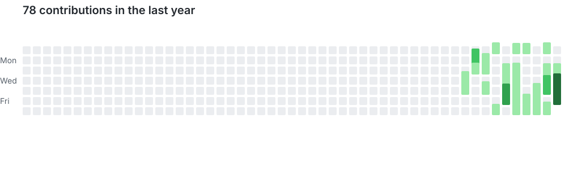

<!--
**loveelixiang/loveelixiang** is a ✨ _special_ ✨ repository because its `README.md` (this file) appears on your GitHub profile.

Here are some ideas to get you started:

- 🔭 I’m currently working on ...
- 🌱 I’m currently learning ...
- 👯 I’m looking to collaborate on ...
- 🤔 I’m looking for help with ...
- 💬 Ask me about ...
- 📫 How to reach me: ...
- 😄 Pronouns: ...
- ⚡ Fun fact: ...
-->

<!-- 

  

 -->

  <picture>
    <source media="(prefers-color-scheme: dark)"
      srcset="https://raw.githubusercontent.com/loveelixiang/loveelixiang/output/github-contribution-grid-snake-dark.svg">
    <source media="(prefers-color-scheme: light)"
      srcset="https://raw.githubusercontent.com/loveelixiang/loveelixiang/output/github-contribution-grid-snake.svg">
    
  </picture>

